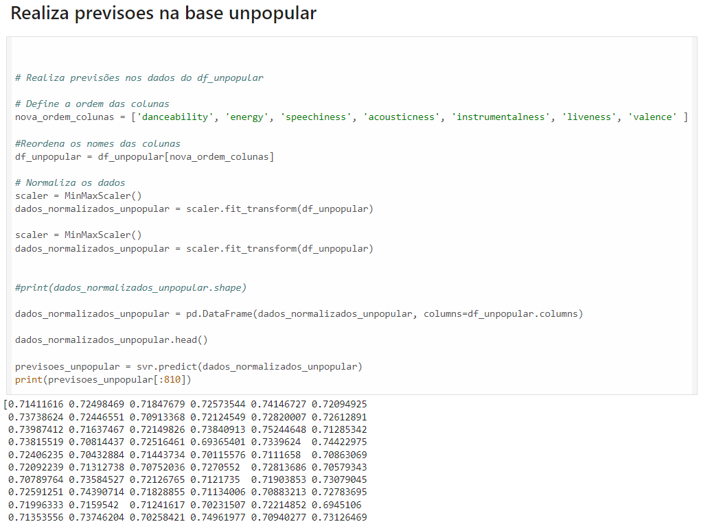

## 6ª Etapa
### Otimização
As previsões realizadas na etapa 5 demonstraram pouca variação. Inicialmente, acreditou-se que este resultado devia-se ao fato de toda a base ser composta de músicas populares, resultando em atributos com valores similares de relevância. Para testar essa hipótese, utilizou-se uma base de músicas impopulares, conforme mostrado abaixo:

No entanto, os valores das previsões continuaram sem uma variação significativa como era esperado, permanecendo com valores similares aos das músicas populares. Isso comprovou a inefetividade do modelo algoritmo elaborado.

Assim, após uma análise extensiva dos dados em busca de um modelo de aprendizado de máquina adequado ao projeto, conclui-se que os atributos presentes na base de dados não são suficientes para obter uma correlação significativa.

A base de dados mostrou-se insuficiente para a elaboração de um algoritmo que pudesse prever a popularidade de uma música com base em seus atributos de áudio.

Acredita-se, entretanto, que a versão paga de desenvolvedor oferecida pelo serviço de streaming Spotify possa conter uma gama mais completa de atributos, permitindo assim a elaboração de um algoritmo capaz de atender ao objetivo inicial deste trabalho.

