## 5ª Etapa
### Análise de Resultados

Como o objetivo inicial era prever os valores da coluna 'popularity' no dataset 'df_2023', e este não possui algumas das features utilizadas no treinamento anterior, novos modelos foram treinados mantendo apenas as features comuns aos dois datasets.

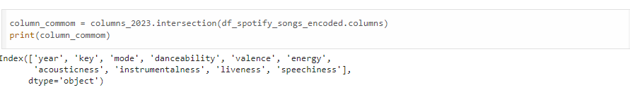

Após identificar as features comuns, as demais foram removidas. Em seguida, o dataset foi normalizado, separado da variável target e dividido em conjuntos de treino e teste.

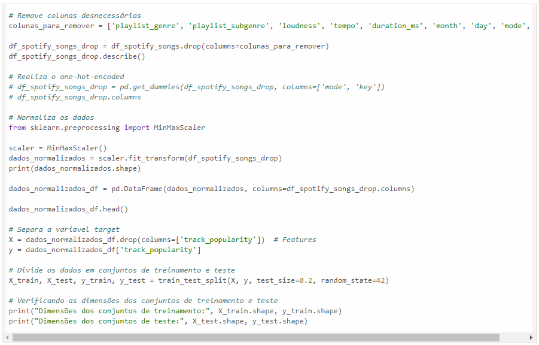

O primeiro modelo foi treinado utilizando o algoritmo de regressão linear.

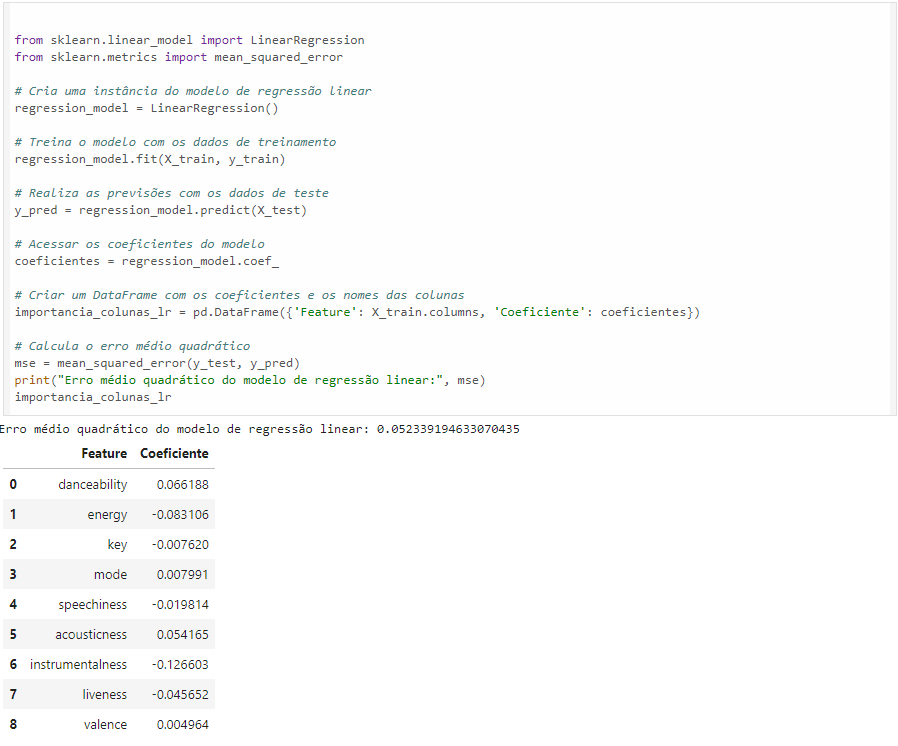

E o segundo utilizando árvore de decisão.

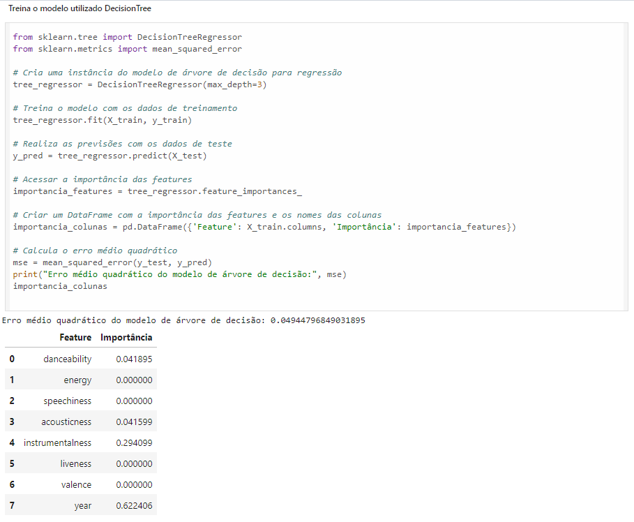

Para realizar a predição sobre os dados do 'df_2023', o dataset também passou pela remoção das colunas extras e pela normalização.

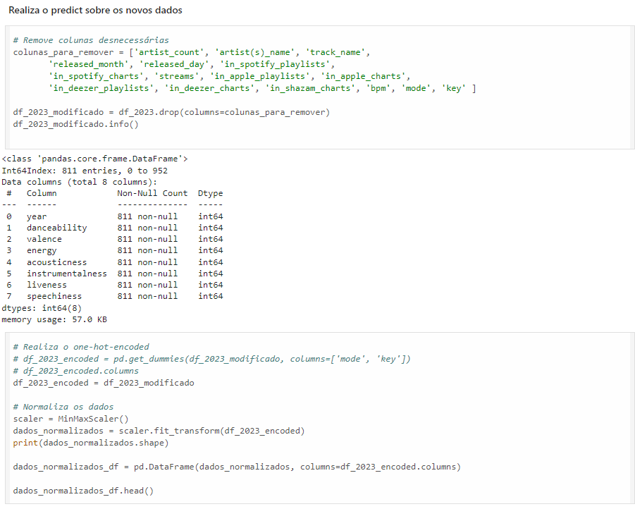

A ordem das colunas foi alterada, o predict foi realizado

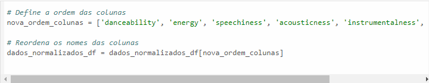

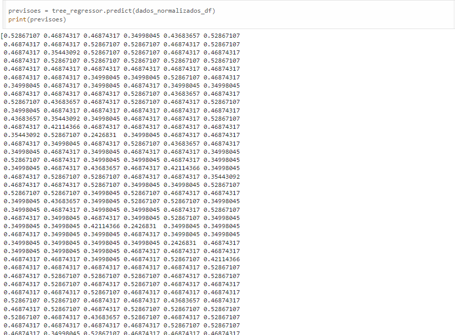

E os dados previstos foram acrescentado ao dataset

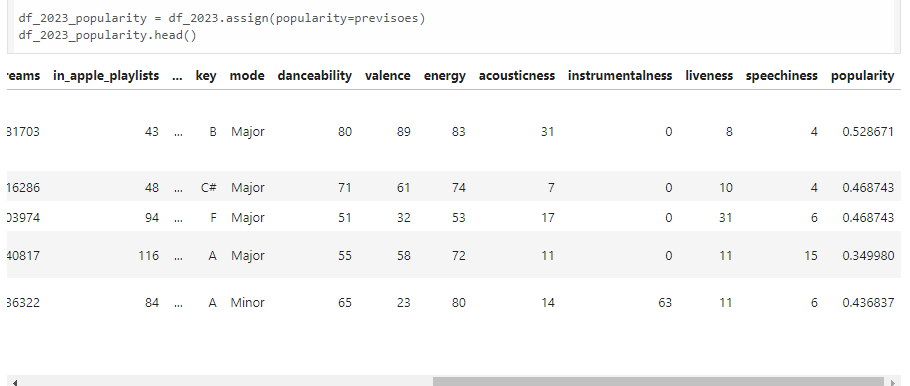

Como o modelo não preveu os valores da coluna de popularidade bem, treinamos alguns modelos com um segundo dataset.

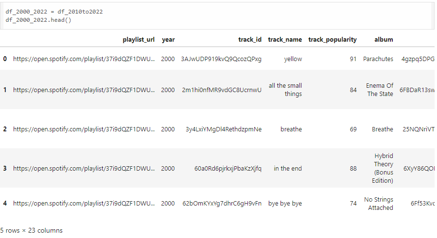
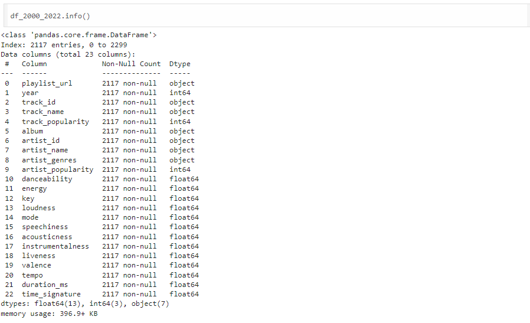

Realizamos a remoção das colunas que não eram comuns aos dois datasets e normalizamos os dados

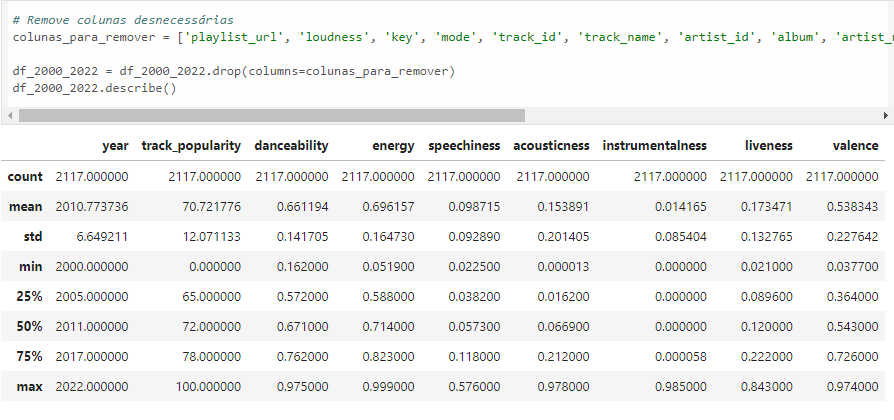
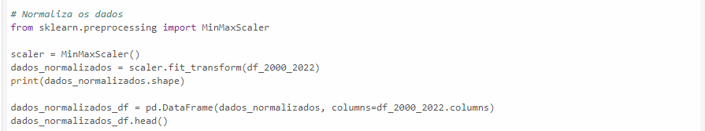

Dividimos o conjunto em treino e teste

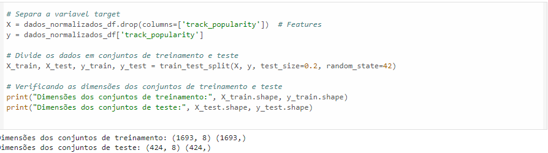

Executa uma avaliação comparativa de diferentes modelos de regressão, buscando encontrar os melhores parâmetros para cada modelo usando a técnica de busca aleatória (Randomized Search CV)

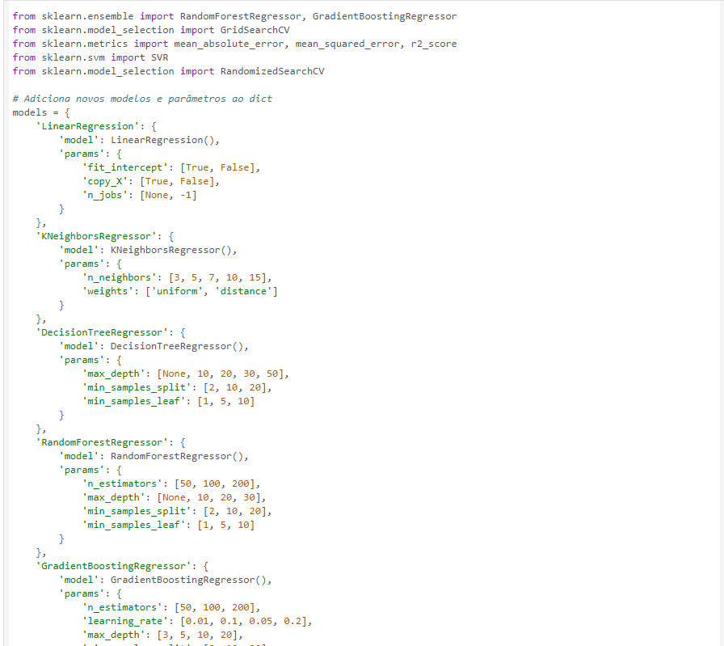
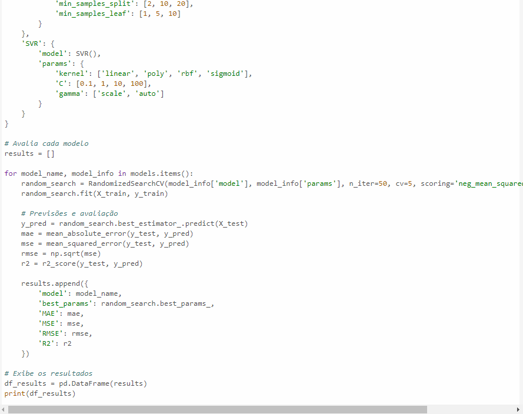

Avaliamos o resultado anterior e realizamos o treinamento do modelo utilizando o algoritmo com as melhores métricas 

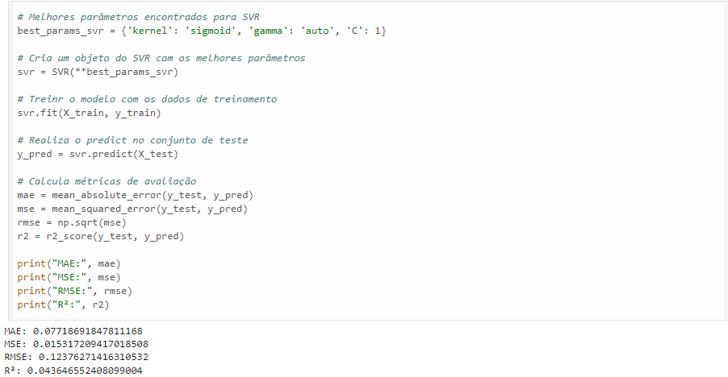

Comparamos o resultado obtido com o modelo com os valores reais do conjunto de teste

Realizamos o predict nos dados do dataset df_2023

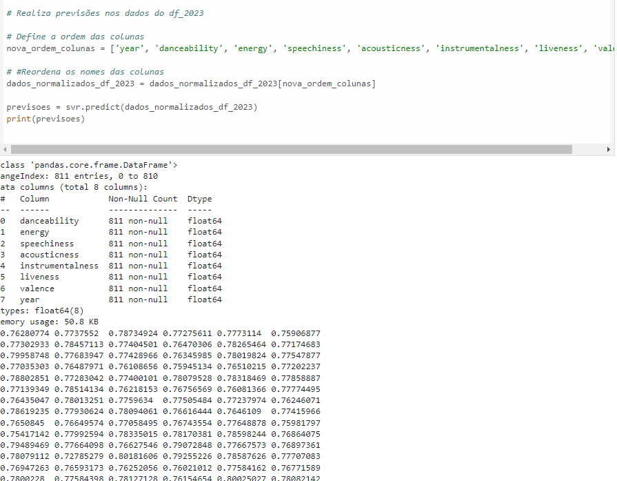

E comparamos os resultados obtidos com os modelos treinados pelos dois datasets

Após uma análise extensiva dos dados, em busca de um modelo de aprendizado de máquina adequado ao projeto proposto, concluiu-se que os atributos presentes na base de dados não são suficientes para obter uma correlação significativa. As relações entre os atributos de áudio e a popularidade apresentaram coeficientes baixos, o que impossibilita a construção de um algoritmo capaz de prever a popularidade com base nesses atributos. Acredita-se que a versão da base de dados de domínio público seja mais limitida que a versão paga. Assim, para uma análise mais acurada, seria necessário um investimento financeiro na obtenção dos dados. 